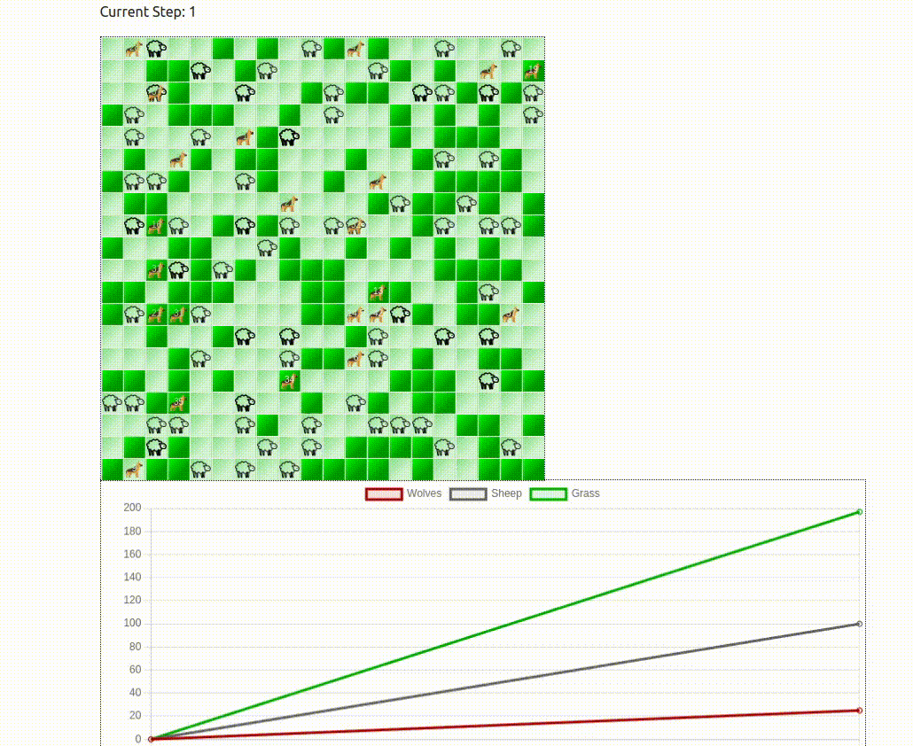

# Reinforcement Learning Implementations with Mesa

This repository demonstrates various applications of reinforcement learning (RL) using the Mesa agent-based modeling framework. These implementations were developed as part of my Google Summer of Code 2024 (GSoC'24) project under Project Mesa.

<p align="center">

</p>

## Getting Started

### Installation

*Given the number of dependencies required, we recommend starting by creating a Conda environment or a Python virtual environment.*
1. **Install Mesa Models**  
   Begin by installing the Mesa models:

   ```bash
   pip install -U -e git+https://github.com/projectmesa/mesa-examples@mesa-2.x#egg=mesa-models
   ```

2. **Install RLlib for Multi-Agent Training**  
   Next, install RLlib along with TensorFlow and PyTorch to support multi-agent training algorithms:

   ```bash
   pip install "ray[rllib]" tensorflow torch
   ```

3. **Install Additional Dependencies**  
   Finally, install any remaining dependencies:

   ```bash
   pip install -r requirements.txt
   ```

### Running the Examples

To test the code, simply execute `example.py`:

```bash
python example.py
```

*Note: Pre-trained models might not work in some cases because of different library versions. In such cases, you can train your own model and use it.*

To learn about individual implementations, please refer to the README files of specific environments.


## Tutorials

For detailed tutorials on how to use these implementations and guidance on starting your own projects, please refer to [Tutorials.md](./Tutorials.md).
