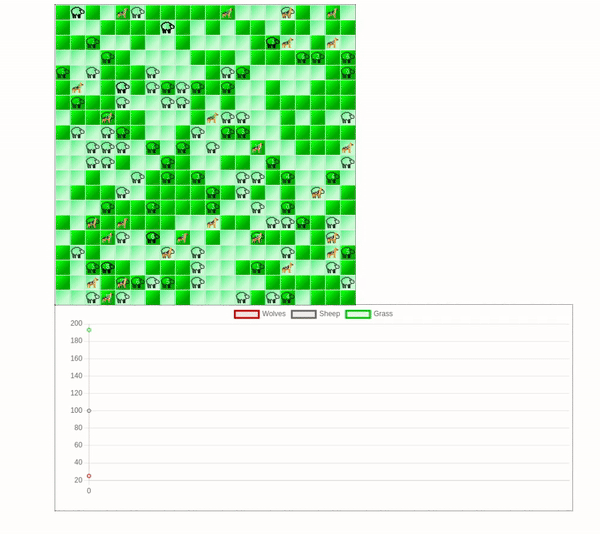

# Reinforcement Learning Implementations with Mesa

This repository showcases distinct applications of reinforcement learning (RL) using the Mesa agent framework. Currently it has this 2 implementation:

1. Balancing Wealth Inequality (Boltzmann Money Model): A single agent governs all others, striving to minimize wealth disparity among them. This experiment embodies a practical application of RL towards economic fairness.

    

2. Collaborative Survival (Wolf-Sheep Predation Model): Multiple agents engage in a competitive and cooperative learning process. Their objective is to maximize collective survival time, demonstrating how RL can foster collaboration in complex environments

    

