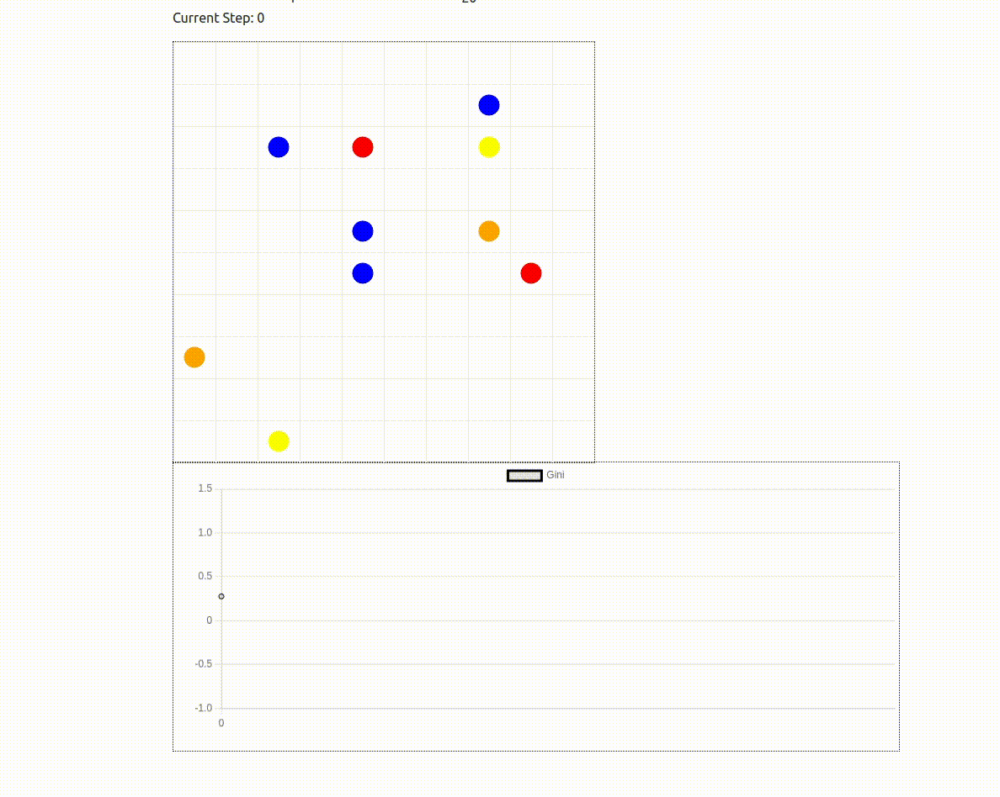

# MESA RL

This repository uses the Mesa agent framework to demonstrate a reinforcement learning (RL) implementation. It showcases how to solve the Boltzmann wealth model with Proximal Policy Optimization (PPO) from Stable Baselines.

## Key features:

- Boltzmann Wealth Model: Agents with varying wealth navigate a grid, aiming to minimize inequality measured by the Gini coefficient.
- PPO Training: A PPO agent is trained to achieve this goal, receiving sparse rewards based on Gini coefficient improvement and a large terminal reward for achieving low inequality.
- Mesa Data Collection and Visualization: The Mesa data collector tool tracks Gini values during training, allowing for real-time visualization.
- Visualization Script: Visualize the trained agent's behaviour with Mesa's visualization tools, presenting agent movement and Gini values within the grid. 
- Pre-trained Model: A model trained for 2 hours on 3 CPU cores is included, achieving equality (Gini < 0.1) in roughly 16-18 steps (significantly faster than a random agent which takes over 150 steps).
- Behaviour: The model behaviour, as shown below shows all the agents moving towards a corner, enabling them to exchange currency and reduce gini coefficients. The behaviour is not optimal and needs improvement.

## Future Work:

- Implement Multi-Agent RL, where multiple agents with different goals optimize their individual wealth.

