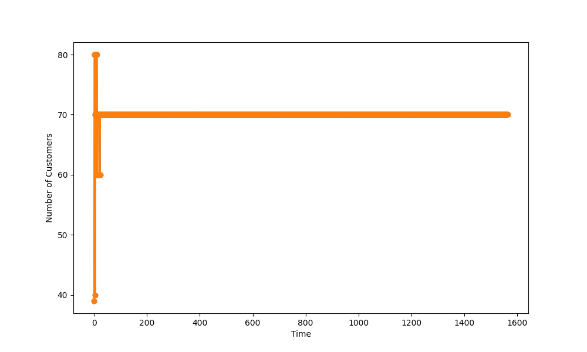
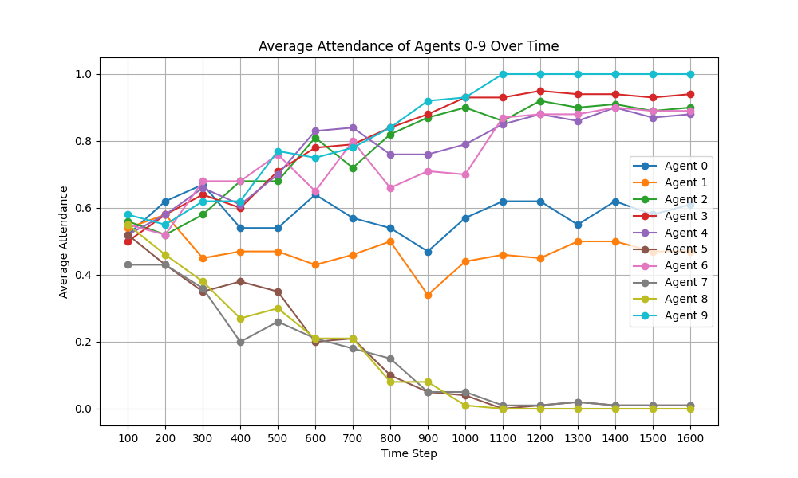

# El Farol
This project demonstrates the use of the RLlib library to implement Multi-Agent Reinforcement Learning (MARL) on the classic El Farol problem. The environment details can be found on the Mesa project's GitHub repository [here](https://github.com/projectmesa/mesa-examples/tree/main/examples/el_farol). Overall the model showcases an example on how to easily inegrate multi agent libraries like RLlib with mesa and use it's visualziation tools to debug and simulate the policy.

# Key Features:

- 100 agents were grouped into 10 policies with varying penalty for entering crowded restaurant.
- The model convergs in around 2000 timesteps to equilibrium
- Agents with higher penalty choose to not go to restaurants whereas other choose to go

